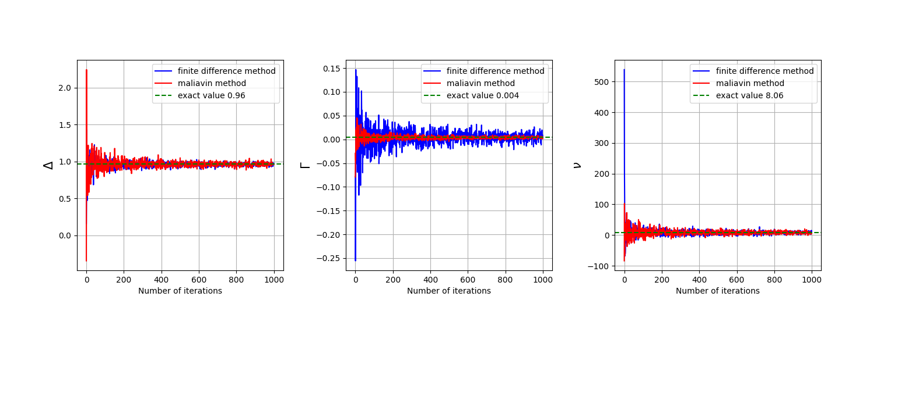

# Malliavin Calculus and Applications to Financial Mathematics : Greeks computation 

Authors : [Anas ESSOUNAINI](https://www.linkedin.com/in/anas-essounaini-b7514014a/) | Rida LAARACH(https://www.linkedin.com/in/rida-laarach/?originalSubdomain=fr)

Supervisor : [Prof. Noufel Frikha](https://www.lpsm.paris/pageperso/frikha/) - [M2MO](https://masterfinance.math.univ-paris-diderot.fr/)

## Table of Contents

- [About](#about)
- [Experiments](#res)
- [References](#ref)
- [Repository structure](#repo)

## About <a name = "about"></a>

The Malliavin calculus, also referred to as stochastic calculus of variations, allows to establish
integration by parts formulas on the Wiener space that write : for some smooth function $f$,
$E[f(X_T )G] = E[f(X_T )H(X_T , G))]$ or $∂_xE[f(X_T )G] = E[f(X_T )H(X_T , G)]$ for some explicit
weight $H(X_T , G)$, where $X_T$ is the solution taken at time $T$ of some non-degenerate stochastic
differential equation. It has many applications, notably in mathematical finance for the computation of Greeks for Delta hedging purpose.
The aims of this project are :

    • to understand the basic principle of Malliavin calculus,

    • to implement the method in some simple examples related to the computation of Greeks
    of financial derivatives.

## Repository structure <a name = "repo"></a>

```
Malliavin-Calculus-Greeks-Monte-Carlo
|---Readme.md
|---.gitignore
|---.gitattributes
|---figures ==> Results of the simulations
|---scripts
|   |---abstract_derivative.py ==> Abstract derivative class
|   |---european_derivative.py ==> Representation of 
|                                  european derivatives
|   |---european_call.py ==> European call class (to run)
|                            with simulations for euopean call
|   |---digital_option.py ==> digital option class (to run)
|                              with simulation for digital  
|                                options
|   
|   |---corridor_option.py ==> corridor option class 
|                                    (to run) with simulations
|
|---doc
    |---report.pdf
    |---slides.pdf
```

## Experiments <a name = "res"></a>

### Figures : 

<figure>
  
  <figcaption><center>fig 1 - Greeks of a european call : Finite Difference Vs Malliavin</center></figcaption>
</figure>

<figure>
  
  <figcaption><center>fig 2 - Greeks of a digital call : Finite Difference Vs Malliavin</center></figcaption>
</figure>

<figure>
  
  <figcaption><center>fig 3 - Greeks of a corridor option : Finite Difference Vs Malliavin</center></figcaption>
</figure>

### Numerical results


| $\frac{Var_{finite difference}}{Var_{malliavin}}$ | $\Delta$ | $\Gamma$          | $\nu$ |
|---------------------------------------------|----------|-------------------|---------|
| Vanilla option                              | 0.40     | 13.21             | 3.93    |
| Binary option                               | 41.49    | 14740486587957.42 | 5.92    |
| Corridor option                             | 88.39    | 61324868176022.72 | 152.49  |

## References <a name = "ref"></a>

[1] Fournié, E. and Lasry, J.-M. and Lebuchoux, J. and Lions, P.-L. and Touzi, N, Applications
of Malliavin calculus to Monte Carlo methods in finance, Finance and Stochastics, Volume 3,
Number 4 (1999), 391–412.

[2] Fournié, E. and Lasry, J.-M. and Lebuchoux, J. and Lions, P.-L. Applications of Malliavin
calculus to Monte-Carlo methods in finance. II, Finance and Stochastics, Volume 5, Number 2
(2001), 201–236.
